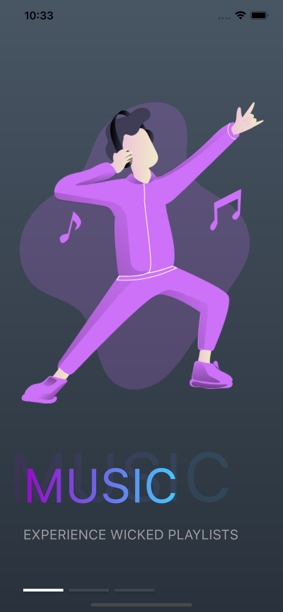
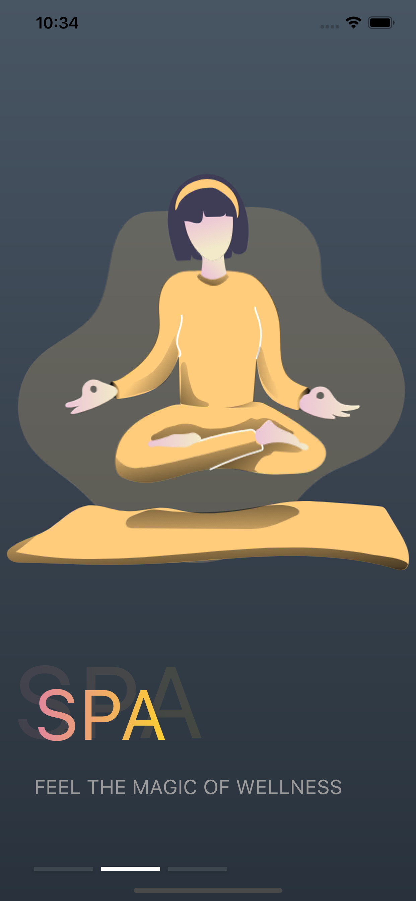
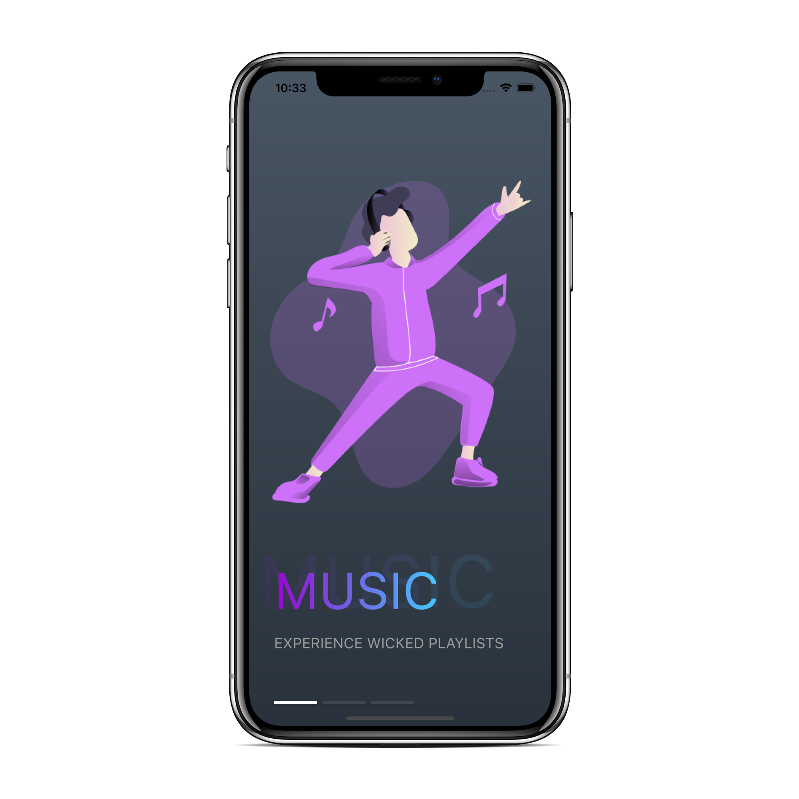

# Flutter-UI-Samples
A Collection of Flutter Material User Interfaces

## [1. Nutrition_App](https://github.com/Safnaj/Flutter-UI-Samples/blob/master/Nutrition_App)

## [2. Leather_Shop](https://github.com/Safnaj/Flutter-UI-Samples/blob/master/Leather_Shop)

## [3. Furniture_App](https://github.com/Safnaj/Flutter-UI-Samples/tree/master/Furniture_App)

## [4. Onboarding_App](https://github.com/hiashutoshsingh/Flutter-UI-Samples/tree/master/Onboarding_App)

  

## [5 . Music_App](https://github.com/Kavindu-Gayantha/Flutter-UI-Samples/tree/music-app)

## [6. Travel_App](https://github.com/Dilshan97/Flutter-UI-Samples/raw/master/Travel_App)

## [7. MarketPlace](https://github.com/mk1107/Flutter-UI-Samples/tree/master/Marketplace)

## [8. Movies_App](https://github.com/sneha-meto/Flutter-UI-Samples/tree/master/movies_app)

## [9. QuizDeck](https://github.com/akshajdevkv/Flutter-UI-Samples/tree/master/QuizDeck)

## [10. TicketBooking_App](https://github.com/nga1hte/Flutter-UI-Samples/tree/master/TicketBooking_App)

